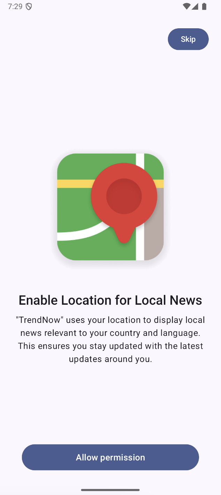
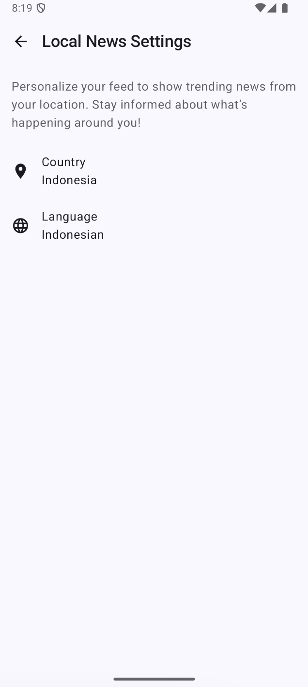

# TrendNow

News aggregator app built using Jetpack Compose with Bonai News API

## Setup

- Get the Bonai News API for free from here https://rapidapi.com/bonaipowered/api/news-api14
- Add the api key to `ApiKey.kt` file inside `app/src/main/java/com/trend/now/` (Need to create the file manually)

```kotlin
package com.trend.now

const val apiKey = "your-api-key"
```

- Run the app (currently using Android Studio Ladybug Feature Drop | 2024.2.2)

## Features

### User features

- Display trending news based on user selected topic
- Local news, display trending news based on user selected county and language.
- TBA

### Technical features

- News cache using `OkHttp` cache and `Room` database
- Automatically detect device location and language to be used for local news preference
- Save user preference on local using `DataStore`
- TBA

## Preview

| |                                               |
|---|-----------------------------------------------|
|  |  |

### Trending news

| Home                                  | Local news                             |
|---------------------------------------|----------------------------------------|
|  |  |

### Local news

| OnBoarding                               | Settings                               |
|------------------------------------------|----------------------------------------|
|  |  |

## Medium articles

Series of medium articles how I build the app

`TBA`